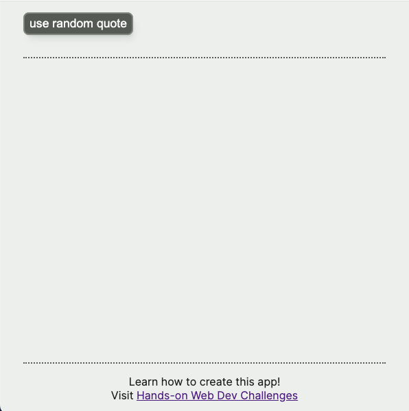
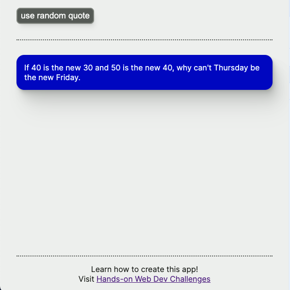

# Hands-on Web Dev AI Style Generator

This code supports the "AI Style Generator" series from the [Hands-on Web Dev newsletter](https://newsletter.howd.dev).

To try the first workshop in this series, [start here](https://newsletter.howd.dev/challenges/029/)!

## Related series

This is the third series to work on the same application. You can find the previous two series here:

- [React Components](https://newsletter.howd.dev/challenges/017/)
- [Next.js Data Fetching](https://newsletter.howd.dev/challenges/023/)

## Getting started

1. [Clone](https://docs.github.com/en/repositories/creating-and-managing-repositories/cloning-a-repository) or [fork](https://docs.github.com/en/pull-requests/collaborating-with-pull-requests/working-with-forks/fork-a-repo) this project.
2. Run `npm install` to install the dependencies
3. Run `npm run dev` to start the dev server
4. Navigate to `localhost:3000` from a web browser

You should see a page that looks like this:

If you click the button the app will display a random quote from [data/quotes.ts](data/quotes.ts), like this:

**Please note**: The quotes were taken from [Kaggle datasets](https://www.kaggle.com/datasets), and **do not necessarily reflect the views of the instructor**.

### Generate an OpenAI API Key

1. create [an OpenAI account](https://platform.openai.com/signup) (if you don't have one already)
2. [generate an API key](https://platform.openai.com/account/api-keys)
3. You may need to make a [nominal payment](https://platform.openai.com/settings/organization/billing/overview) in order to get started. To give you a point of reference: to develop the app for this series, I spent a total of $0.24 total over about six weeks. I have never spent more than $0.05 in one day, and most days it was **much** less (less than $0.01).

## This project uses...

- [Next.js](https://nextjs.org/)
- [TypeScript](https://www.typescriptlang.org/)
- [CSS modules](https://github.com/css-modules/css-modules)
- Josh W. Comeau's [delightful file structure](https://www.joshwcomeau.com/react/file-structure/)
